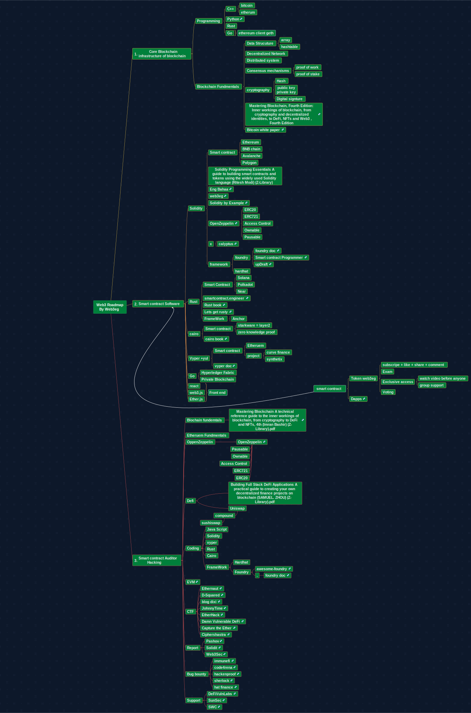

# Web3-Blockchain-Developer-Roadmap-Arabic

## Roadmap

# 1- Core Blockchain
 - Programming   
   - c+
   - python
   - rust
   - go
   
   
- Blockchain Fundmentals
  - Data Structure
  - Decenteralized Network
  - [Distributed System](https://www.youtube.com/playlist?list=PLrw6a1wE39_tb2fErI4-WkMbsvGQk9_UB)
  - Consensus Mechanisms
      - pow
      - pos
  - Cryptography
  - Bitcoin white paper
  - Ethereum White paper

